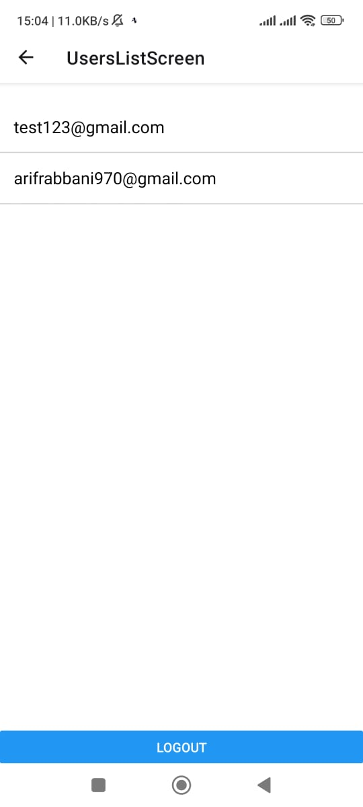

# 📱 React Native Chat App

A simple real-time **1-on-1 chat application** built with **React Native**, **Firebase**, and **Expo**. Users can sign up, log in, view other users, and chat in real time. Built for learning and rapid prototyping of messaging apps.

---

## 🔧 Features

- ✅ Email/Password authentication with Firebase Auth  
- ✅ Real-time messaging via Firebase Firestore  
- ✅ View all registered users (except yourself)  
- ✅ Chat with any user — messages are stored per chat session  
- ✅ Unique chat rooms (IDs) per user pair  
- ✅ Logout functionality  

---

## 📂 Project Structure

ChatApp/ ├── App.js ├── firebase.js ├── screens/ │ ├── WelcomeScreen.js │ ├── SignUpScreen.js │ ├── SignInScreen.js │ ├── UsersListScreen.js │ └── ChatScreen.js └── assets/

---

## 📲 How to Install and Use

### Prerequisites

- Node.js and npm installed
- Expo CLI installed (`npm install -g expo-cli`)
- Firebase project (setup explained below)
- Android/iOS device with Expo Go app OR Emulator

---

### 🔥 Firebase Setup

1. Go to [Firebase Console](https://console.firebase.google.com/) and create a new project.

2. Enable **Authentication**:
   - Go to **Build → Authentication → Sign-in method**
   - Enable **Email/Password**

3. Enable **Firestore Database**:
   - Go to **Build → Firestore Database**
   - Click **Create database**, start in test mode

4. Create a web app in your Firebase project:
   - Go to **Project Settings → Add App → Web**
   - Register it and copy your Firebase config

5. Replace the config inside `firebase.js`:

// firebase.js
import { initializeApp } from 'firebase/app';
import { getAuth } from 'firebase/auth';
import { getFirestore } from 'firebase/firestore';

const firebaseConfig = {
  apiKey: 'YOUR_API_KEY',
  authDomain: 'YOUR_DOMAIN.firebaseapp.com',
  projectId: 'YOUR_PROJECT_ID',
  storageBucket: 'YOUR_PROJECT_ID.appspot.com',
  messagingSenderId: 'XXXXXX',
  appId: 'XXXXXX',
};

const app = initializeApp(firebaseConfig);
export const auth = getAuth(app);
export const db = getFirestore(app);
git clone https://github.com/YOUR-USERNAME/ChatApp.git
cd ChatApp
git clone https://github.com/YOUR-USERNAME/ChatApp.git
cd ChatApp
Install dependencies: npm install
Start the development server: npx expo start
Open it:

On device: Scan the QR using Expo Go

On emulator: Press 'a' for Android or 'i' for iOS

👤 How to Use the App
Sign Up for a new account

You'll be navigated to the Users List

Select any user to start chatting

Type and send messages — they’ll be stored in Firestore

Use the Logout button to exit

Note: You must sign up with at least two users to test chatting.//

## 📸 Screenshots

